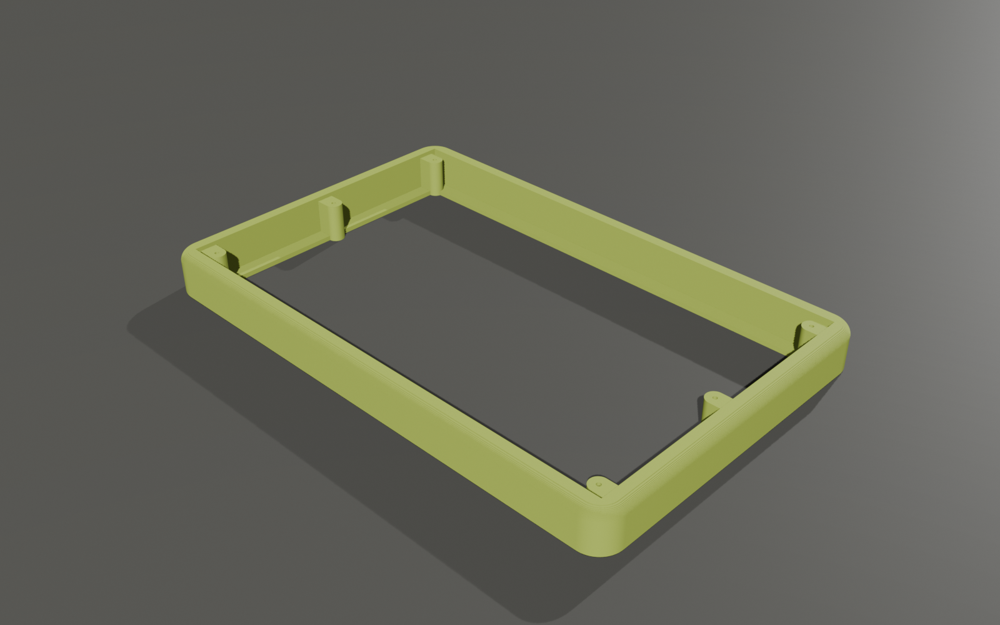
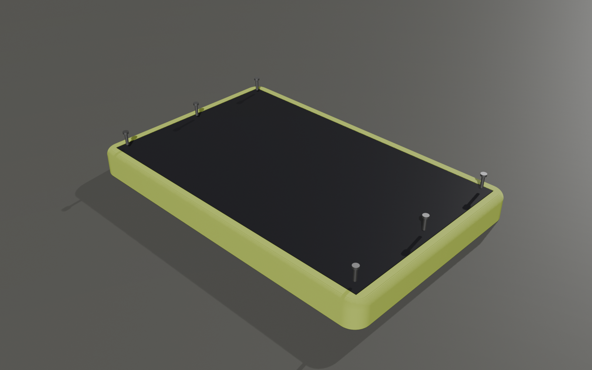

# Base imprimible para la PercuSynth V2.0

Reemplazo en plástico del marco de madera, pensado para quien arma el PercuSynth
fuera de Chile. Es un marco de pared ancha, con las esquinas y el canto superior
redondeados. Va abierto por debajo y sin travesaños, con seis postes donde se
atornilla la placa.





## Archivos

| Archivo | Para qué |
|---|---|
| `base_percusynth_v2.stl` | Listo para el slicer |
| `base_percusynth_v2.3mf` | Lo mismo, en 3MF (Bambu Studio / PrusaSlicer / Cura) |
| `generar_base.py` | La fuente: todas las medidas son parámetros al inicio del archivo |

## Medidas

- Exterior: **215,8 × 139,2 × 17,6 mm**. Necesita una cama de **220 × 220 mm** o más.
- Pared de 7 mm. Esquinas con radio de 10 mm y canto superior con radio de 4 mm.
- Material: 93 cm³ si se imprimiera maciza. Con 15–20 % de relleno, el slicer da bastante menos.
- Placa: 201,0 × 124,4 × 1,6 mm, sacada del contorno de los gerbers V2.0.

## Imprimir

- **Posición:** tal como viene, con la cara plana sobre la cama. No necesita soportes.
- **Material:** PLA o PETG.
- **Capa:** 0,2 mm.
- **Relleno:** 15–20 %. Casi todo son paredes, así que el relleno influye poco.
- **Perímetros:** 3 o más, para que los postes queden sólidos alrededor del tornillo.

## Montar

1. Coloca la placa encima de manera que los seis agujeros coincidan con los postes.
2. Atornilla la placa con **6 tornillos autorroscantes M2 × 6 mm**. Con M2 × 8 también sirve: el agujero guía mide 1,7 mm y es ciego, así que la punta no sale por abajo.

La pared llega exactamente al ras de la cara superior de la PCB, a propósito. Los jacks, el USB-C, el MIDI, la salida del DAC y las borneras enchufan desde el borde de la placa, y una pared más alta los taparía.

Bajo la placa quedan 16 mm de aire. Ahí van los 6 LEDs WS2812, montados por la cara inferior, y las patas de los componentes.

## Ajustar

Todo se cambia en `generar_base.py`:

| Parámetro | Valor | Qué controla |
|---|---|---|
| `PARED` | 7 mm | Grosor de la pared. |
| `RADIO_ESQUINA` / `RADIO_CANTO` | 10 / 4 mm | Redondeo de las esquinas y del canto superior. |
| `HOLGURA` | 0,4 mm | Juego por lado entre la placa y la pared. Súbelo si la placa entra muy apretada. |
| `PILOTO_D` | 1,7 mm | Agujero guía del tornillo. Usa 3,2 mm si vas a poner insertos térmicos M2. |
| `AIRE` | 16 mm | Distancia de la mesa a la cara inferior de la placa. |
| `BORDE` | 0 mm | Cuánto sube la pared por encima de la placa. Sobre 1 mm empieza a estorbar a los plugs. |

Para volver a generar el modelo:

```bash
pip install manifold3d trimesh numpy
python generar_base.py
```
